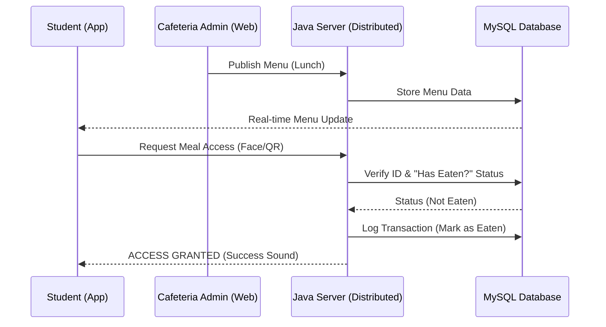

# Distributed Cafeteria Management System: Demonstration & Flow Guide

This document provides a structured walkthrough for demonstrating the **Distributed Cafeteria Management System**. It covers the roles of each actor, the system's operational flows, and the technical architecture that ensures a seamless campus experience.

---

## 1. Project Overview
The system is a **multi-tier distributed application** designed to automate cafeteria operations. It bridges the gap between manual records and digital management by integrating:
*   **Android Mobile Client**: For student interaction and verification.
*   **Java EE Distributed Server**: For business logic and real-time processing.
*   **MySQL Database Cluster**: For secure, synchronized data storage.

---

## 2. Actors & Roles

### 👤 Registrar Administrator
*   **Role**: Identity Management.
*   **Key Responsibilities**:
    *   Registering new students into the central database.
    *   Managing student profiles and department assignments.
    *   Issuing and managing digital student IDs.
*   **Interface**: `registrar_admin.html`

### 🍲 Cafeteria Administrator
*   **Role**: Operations & Content Management.
*   **Key Responsibilities**:
    *   Publishing daily and weekly menus (Breakfast, Lunch, Dinner).
    *   Broadcasting campus-wide announcements.
    *   Monitoring meal activity and generating reports for kitchen planning.
*   **Interface**: `menu_admin.html`, `message_admin.html`

### 🛡️ Cafeteria Staff (Gatekeeper)
*   **Role**: Verification & Access Control.
*   **Key Responsibilities**:
    *   Verifying student identity at the cafeteria entrance.
    *   Using **QR Code Scanning** for fast-track entry.
    *   Using **AI Face Verification** for secure, card-less entry.
*   **Interface**: `scanner.html`, `face_verify.html`

### 🎓 Student
*   **Role**: End-User.
*   **Key Responsibilities**:
    *   Enrolling biometric face data (Self-service).
    *   Checking the daily menu via the Android app.
    *   Viewing personal meal history and transaction logs.
    *   Presenting QR code or face for meal access.
*   **Interface**: Android App, `biometric_enroll.html`

---

## 3. System Flow (The Lifecycle)

### Phase 1: Onboarding
1.  **Registration**: The **Registrar** creates the student account.
2.  **Enrollment**: The **Student** logs into the portal and uploads their "Face Template" for biometric verification.

### Phase 2: Daily Operations
1.  **Menu Publishing**: The **Cafeteria Admin** updates the menu for the day (e.g., "Doro Wat with Injera").
2.  **Notification**: The menu is instantly visible to all **Students** on their mobile devices.

### Phase 3: Meal Verification (The Core Flow)
1.  **Arrival**: The **Student** arrives at the cafeteria.
2.  **Identity Check**:
    *   *Option A*: Student stands in front of the AI camera (`Face Verification`).
    *   *Option B*: Student shows their unique QR code from the app (`QR Scanner`).
3.  **Distributed Consistency Check**:
    *   The server checks if the student has already eaten the current meal (e.g., already had Lunch?).
    *   If **GRANTED**: The system logs the transaction and alerts the staff with a "Success" sound.
    *   If **DENIED**: The system blocks entry, preventing double-use of meal credits.

### Phase 4: Monitoring
1.  **History**: The **Student** can see exactly when they ate in their "Meal History" tab.
2.  **Analytics**: The **Admin** views the total count of students served to optimize food production.

---

## 4. Technical "Wow" Factors for Demonstration
*   **Real-time Synchronization**: Show how a menu update on the web portal appears instantly on the Android app.
*   **Biometric Accuracy**: Demonstrate the AI face recognition logic identifying a student without any physical ID card.
*   **Fault Tolerance**: Explain how the system handles network timeouts and ensures data integrity during high-traffic meal times.
*   **Premium UI**: Highlight the "Glassmorphism" design and smooth animations that give the system a modern, state-of-the-art feel.

---

## 5. Visual Flow Diagram

